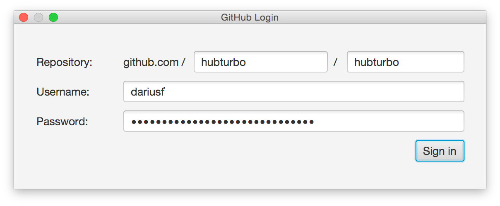

# Getting Started

To use HubTurbo, you'll need:

- A [GitHub account](https://github.com/login)
- [Java 8u40](http://www.oracle.com/technetwork/java/javase/downloads/index.html) or later
- [Google Chrome](http://www.google.com/chrome/)

Once you have the above, grab the installer from [here](https://github.com/HubTurbo/AutoUpdater/releases/download/V0.9.0/HubTurbo.jar) and run it. 
It will download the latest HubTurbo version and launch it. 

When HubTurbo runs for the first time, you'll be presented with a login dialog similar to the one shown below. 
Provide the URL of one of the repositories you want to access and your GitHub account details.

When you click the `Sign in` button, HubTurbo will download the issues from the repo you specified and present to you 
 the typical HubTurbo interface (similar to the screenshot at the beginning of this page). 
That's it -- you're now all set to start using HubTurbo!

Before you start using HubTurbo features, you may want to check out [the basics of navigating GitHub using HubTurbo](UI-Basics.md).
