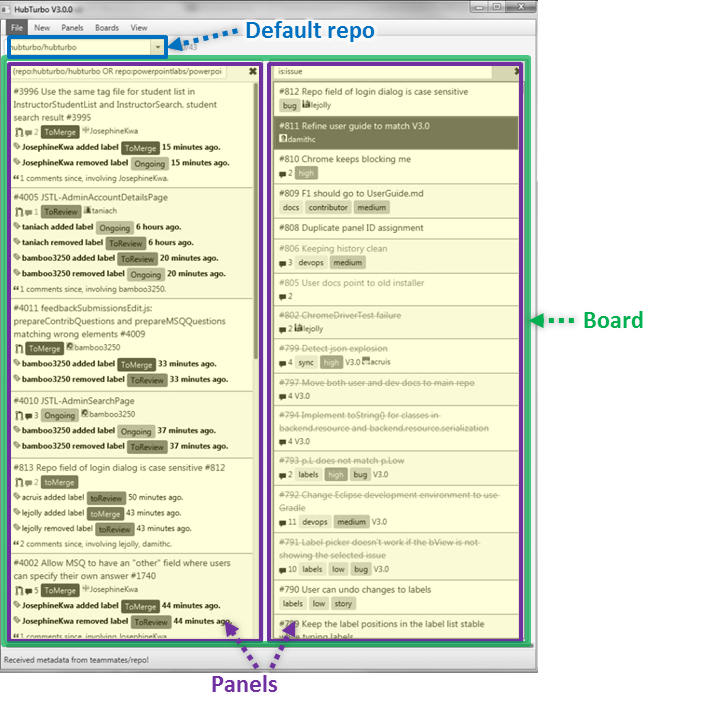

# UI Basics

Here we'll get an overview of the essential parts of HubTurbo's user interface.

HubTurbo's interface has two parts: The **panel view** and the **browser view**.

## Panel View

The **panel view** displays a **board** which contains a collection of **panels**. 

A panel provides a 'filtered view' into the issue tracker by displaying a list of 
**issue cards** that match the **filter** you specify at the top of the panel. 
You can have any number of panels in a board, to get a side-by-side view of all issues you are interested in. 

For example, a board can contain three panels showing,

1. all open issues assigned to you from projects *alpha*, *beta*, and *gamma* (yes, a panel can show issues from multiple projects)
2. all issues of project *beta* updated within the last 24 hours  
3. all open issues allocated to the next upcoming milestone in *project alpha*

Boards can be named, saved, and reloaded. For example you can have one board called 'work projects' and another called 'pet projects'. 
However, HubTurbo can display only one board at a time.

The **default repository** dropdown allows you to specify what HubTurbo considers to be the *default repository*. 
HubTurbo can be viewing many repositories at once; if you do not specify a repository, 
HubTurbo assumes you meant to work with the default repository. 

Further references: [boards and panels](Boards-and-Panels.md) | [issues](Issues.md) | [filters](Filters.md)

## Browser View

The **browser view** is a Chrome Window controlled by HubTurbo, and it shows GitHub pages as needed by the panel view; 
for example, clicking on an issue in a panel will make the browser view to navigate to the corresponding issue page on GitHub.

## HubTurbo Workflow

The general workflow is to switch back and forth between the two windows, 
staying in the panel view as much as possible to take advantage of extra productivity features 
provided by HubTurbo (e.g. keyboard shortcuts), and going to the browser view for working with issue details when necessary.

Further references: [keyboard shortcuts](Keyboard-Shortcuts.md)
