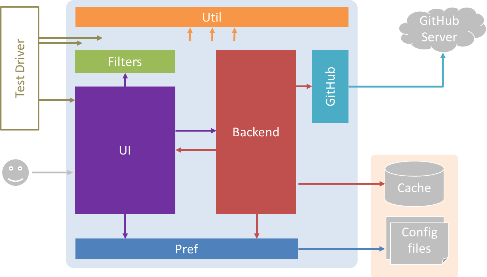
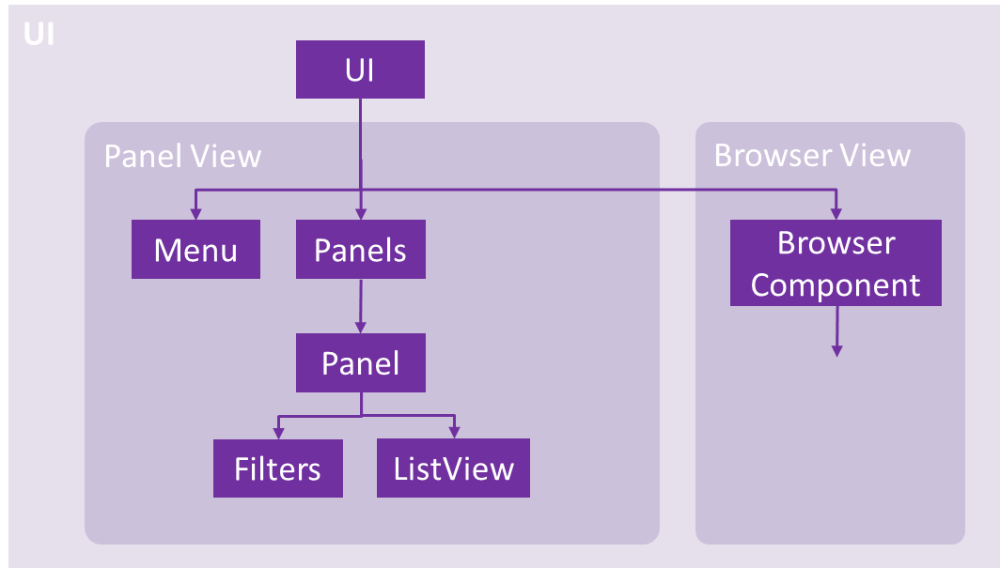
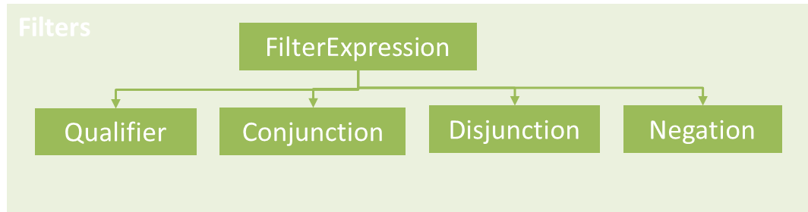
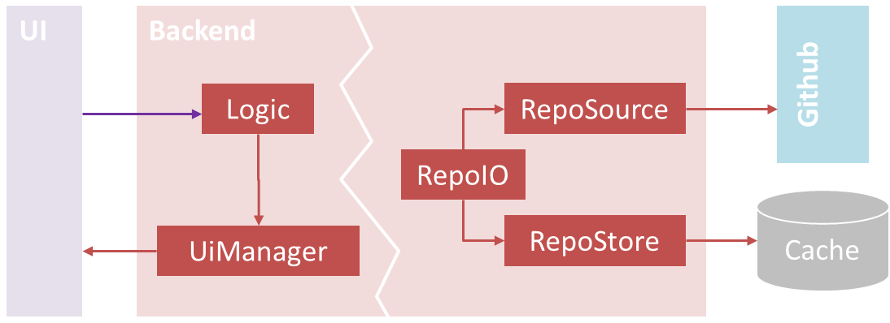

# Design

## Architecture

- **UI**, **Uti**, **Backend**, **TestDriver** : self explanatory.
- **Pref** : Handles user preferences.
- **GitHub** : An adapter to access GitHub remote API.
- **Filters** : Handles processing of filters used to filter issues.

## UI Component

HubTurbo's UI has two components: *Panel View* and *Browser View*.

The **Panel view** is implemented using JavaFX. 
The user interface is implemented in an intuitive hierarchical fashion. Much like the HTML DOM tree, 
it is constructed with many levels of nested containers, and the leaves of the tree are where concrete, 
interactive, and more general-purpose UI widgets may be found.

The **Browser View** is implement using Selenium Web Driver.

## Filters Component

Filtering is implemented via a tiny external [DSL](http://en.wikipedia.org/wiki/Domain-specific_language) written in Java. 
Language expressions consist of a series of predicates (called *qualifiers* in GitHub parlance), composed with operators. 
Issues are then checked against these expressions to determine if they match.

The high-level process of filtering is as follows:

1. Lexical analysis is performed on the input string, turning it into a stream of tokens.
2. Parsing is then carried out with a [top-down operator precedence](http://en.wikipedia.org/wiki/Pratt_parser) algorithm. 
   This turns the tokens into an abstract syntax tree consisting of the classes shown in the above diagram.
3. The AST is then interpreted, with issues as input, in one of a few ways.
    - Filtering issues will evaluate the AST with `FilterExpression::isSatisfiedBy`. 
    This recursively checks if an issue matches what is represented by the AST.
    - An alternative means of evaluation is `FilterExpression::applyTo`, which compares the characteristics 
    of issues against what the AST represents and applies the characteristics that are absent *to* the issue.

### Key Classes

#### `Model`

This is HubTurbo's representation of a single repository. It consists of immutable collections 
of `Turbo`- resources. This is the main type of object that is relayed from the back end to the `UI`.

May be converted back and forth from its `Serializable`- version for persistence.

#### `MultiModel`

An aggregation of `Models`, to represent the fact that HubTurbo supports having multiple 
repositories loaded at once. It is a mutable collection, and so should be thread-safe. 
An interface is used to hide its mutability from the `UI`, since the latter may operate directly on it.

#### `Turbo`- Resources

`RepoSource`-agnostic representations of the various types of resources that may be found in a repository. 
They consist mostly of immutable fields.

They also consist of transient fields, not present in their `Serializable`- versions, 
which store non-persistent metadata, such as events and comments.

## Backend Component

The backend component contains application logic that isn't directly 
tied to the UI, such as end-to-end process of loading repositories, 
fetching updates to issues, caching, and so on.

The circular dependency between `UI`, `Logic`, and `UIManager` illustrates how data flows in the application: 
`UI` maintains a reference to `Logic`, calling methods directly to trigger application-level actions.

Upon carrying these out, `Logic` communicates with `UI` via `UIManager`, a thin abstraction layer 
responsible for propagating the changes to the underlying data model back out, to be rendered by the user interface.

### Key classes

#### `Logic`

`Logic` is a facade to the entire back end, providing *an interface whose methods correspond directly 
to application-level actions*. For example, a user might open a repository, then select Refresh from the menu. 
These actions are reified in the methods `Logic::openRepository` and `Logic::refresh`.

`Logic` also maintains application-level state, such as the user's credentials, which repositories are open, and so on.

#### `RepoIO`

As far as `Logic` methods are concerned, actions such as opening a repository result in a collection 
of issue objects, ready for use. The details of where this data actually comes from are handled by `RepoIO`, 
which abstracts away the differences between the actual repository on GitHub and the local store.

Logic related to when caching occurs, what happens on issue objects arriving, and so on is all contained here.

#### `RepoSource`

`RepoSource` represents an abstract source of repository data: issues, labels, milestones, and such. 
One such concrete source is GitHub itself.

In addition to the interface it exposes, `RepoSource` provides a work queue and utility methods for 
carrying out repository operations concurrently.

Subclassing `RepoSource` and implementating its methods is conceptually how we may support 
an alternative source of issues in future.

#### `RepoStore`

`RepoStore` represents an abstract store for repository data. One such concrete store is a JSON file.

`RepoStore` also serves double duty, providing a work queue so caching may be carried out safely, 
without race conditions, while allowing the UI to remain responsive.

Subclassing `RepoStore` may be used to implement an alternative store.

