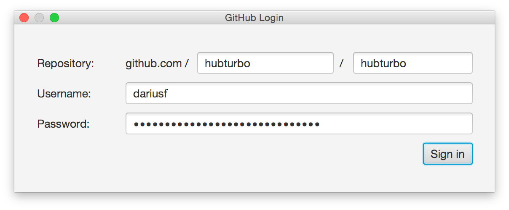
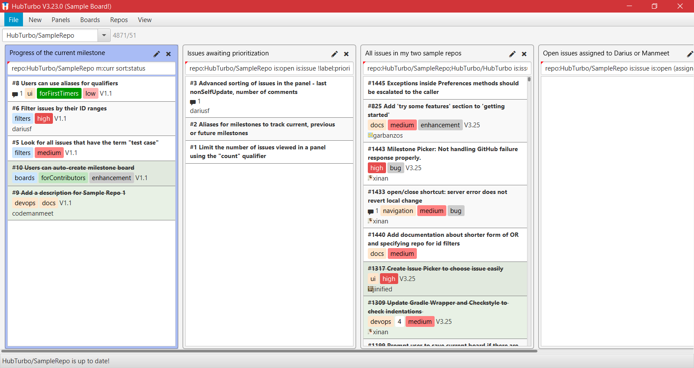
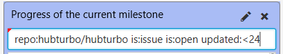
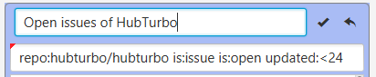
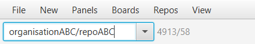
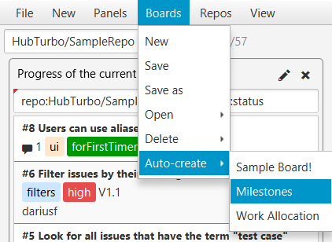

# Getting Started

## Pre-requisites

To use HubTurbo, you'll need:

- A [GitHub account](https://github.com/login)
- [Java 8u60](http://www.oracle.com/technetwork/java/javase/downloads/index.html) or later
- [Google Chrome](http://www.google.com/chrome/)

## Installation

Once you have the above, grab the installer from [here](https://github.com/HubTurbo/AutoUpdater/releases/download/V0.9.0/HubTurbo.jar) and run it. 
It will download the latest HubTurbo version and launch it. 

When HubTurbo runs for the first time, you'll be presented with a login dialog similar to the one shown below. 
Provide the URL of one of the repositories you want to access and your GitHub account details.

When you click the `Sign in` button, HubTurbo will download the issues from the repo you specified and present to you 
 the typical HubTurbo interface.
 
 
  
Before you start using HubTurbo features, let us take a few minutes to learn basic concepts of the HubTurbo UI.

## UI Basics

HubTurbo's interface has two parts: The **panel view** and the **browser view**.

### Panel View

The **panel view** displays a **board** which contains a collection of **panels**. 

A panel provides a 'filtered view' into the issue tracker by displaying a list of 
**issue cards** that match the **filter** you specify at the top of the panel. 
You can have any number of panels in a board, to get a side-by-side view of all issues you are interested in. 

For example, a board can contain three panels showing,

1. all open issues assigned to you from projects *alpha*, *beta*, and *gamma* (yes, a panel can show issues from multiple projects)
2. all issues of project *beta* updated within the last 24 hours  
3. all open issues allocated to the next upcoming milestone in *project alpha*

Boards can be named, saved, and reloaded later. For example you can have one board called 'work projects' to interact 
with work related projects and another board called 'pet projects' to interact with your hobby projects. 

The **default repository** dropdown allows you to specify what HubTurbo considers to be the *default repository*. 
HubTurbo can be viewing many repositories at once; if you do not specify a repository, 
HubTurbo assumes you meant to work with the default repository. 

### Browser View

The **browser view** is a Chrome Window controlled by HubTurbo, and it shows GitHub pages as needed by the panel view; 
for example, clicking on an issue in a panel will make the browser view to navigate to the corresponding issue page on GitHub.

## HubTurbo Workflow

The general workflow is to switch back and forth between the two windows, 
staying in the panel view as much as possible to take advantage of extra productivity features 
provided by HubTurbo (e.g. keyboard shortcuts), and going to the browser view for working with issue details when necessary.

## Try Some Features 

Now that you are familiar with HubTurbo's UI and workflow, let's try some of its features.

### Editing the Sample Board 

When you launch HubTurbo for the first time, a Sample Board will be shown. We can try some features of HubTurbo using this Sample Board. 

**Edit a filter** 

One useful feature of HubTurbo is filtering. You can obtain a panel that contains issues that you are interested in by changing its filter. For example, if you want to view all the open issues of HubTurbo, replace the contents of the first panel's text field with `repo:hubturbo/hubturbo is:issue is:open` and <kbd>enter</kbd>.

 

**Rename a panel**

After changing the filter of the first panel, you may wish to rename the panel to describe its contents correctly. To do so, simply click on the pencil icon  at the top right corner of panel, type the new name of the panel in the text field that appears and press <kbd>enter</kbd>. For example,   

 

**Save your changes**

To save the changes you made to Sample Board, please click `Boards > Save`. 

### Access Another Repository 

To access another repository in HubTurbo, simply type `<Owner of repository>/<Repository name>` in the default repository dropdown and press <kbd>enter</kbd>. HubTurbo will then take a few moments to show the issues of the repository. 

For example, if you would like to view the issues of `repoABC` which is owned by `organisationABC`, you will need to type `organisationABC/repoABC`. 

 

### Generate A Milestones Board 

To aid in tracking the progress of you project, you can generate a Milestones Board that lists issues according to their milestones. You can do so by clicking `Boards > Auto-create > Milestones`. 

Please visit this [link](boards.md) to learn more about other useful boards you can auto-create in HubTurbo. 

 