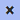

# Panels

## Adding a New Panel 

Panels can be added using the menu or keyboard shortcuts. 

- `Panels > Create Panel` to add a panel on the right of the currently selected panel.
    - <kbd>Ctrl</kbd> + <kbd>P</kbd> will do the same.

- `Panels > Create Panel (Left)` to add a panel on the left.
    - <kbd>Ctrl</kbd> + <kbd>Shift</kbd> + <kbd>P</kbd> will do the same.

## Closing a Panel 

- Click  at the top of the panel.

- `Panels > Close Panel`
    - <kbd>Ctrl</kbd> + <kbd>W</kbd> will do the same.

## Reordering Panels 

Panels can be reordered simply by dragging them into the desired position.

- Click anywhere on the head or borders of the panel and drag it to the left or right.

## Renaming Panels 

1. To __start__ renaming, double click the panel name or click  at the top right corner of the panel.
2. Type the new name in the text field.
3. __Save__ the new name by pressing <kbd>Enter</kbd> or clicking  at the top right corner of the panel.

To __abort__ the renaming action any time before step 3, press <kbd>Esc</kbd> or click  at the top right corner of the panel.
